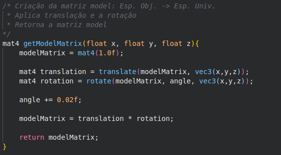

# Pipeline Gráfico

## 1. Introdução

Este trabalho tem como objetivo implementar o pipeline gráfico, passnado os vértices do objeto pelo espaço do objeto até o espaço de tela, através de transformações.

## 2. Transformações

### 2.1. Espaço do Objeto para o Espaço do Universo

Na primeira etapa do pipeline gráfico é realizada a transformação dos vértices do objeto que estão no espaço do objeto, local onde os objetos são criados, para o espaço do universo, o sistema de coordenadas da cena. Para isso, é criada a matriz model que pode conter a matriz identidade ou pode ser realizada uma composição de translações, escalas, rotações e shears, através da multiplicação dessas matrizes.

> 

Aqui, por exemplo, a matriz model é inicializada com a matriz identidade. Após são criadas duas matrizes, a de translação e a de rotação, e então essas matriz são aplicadas a matriz model por sua multiplicação. É importante notar que a ordem da multiplicação importa, no caso, a rotação está sendo aplicada primeiro e depois a translação.

Está sendo usada matrizes 4x4 para representar o espaço 3D.

### 2.2. Espaço do Universo para o Espaço da Câmera

