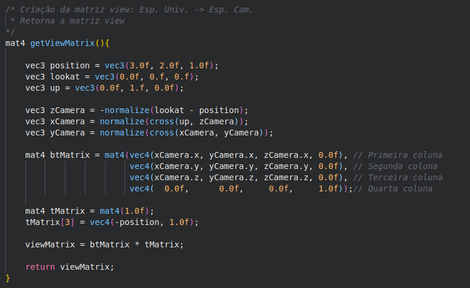
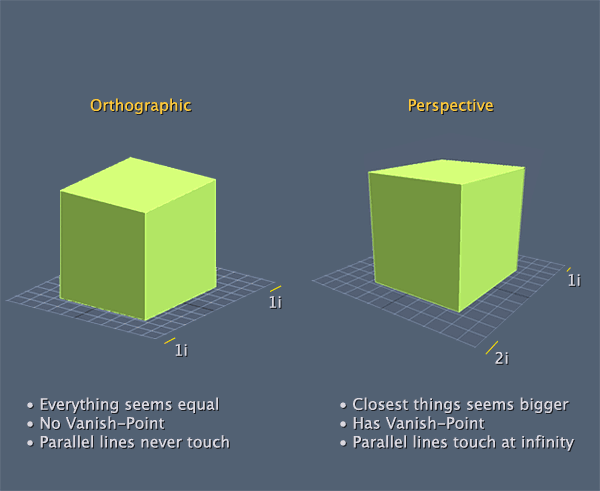
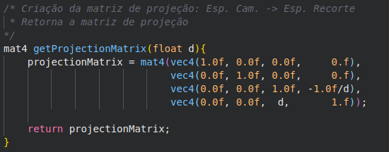
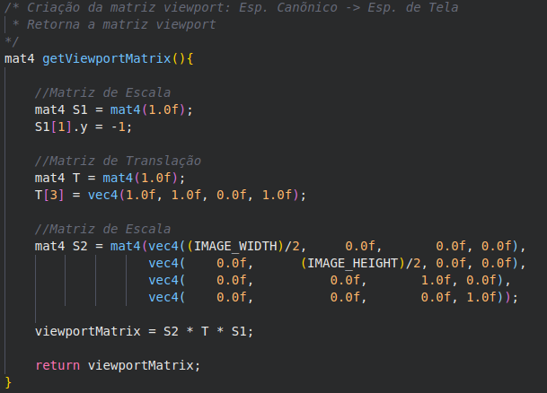
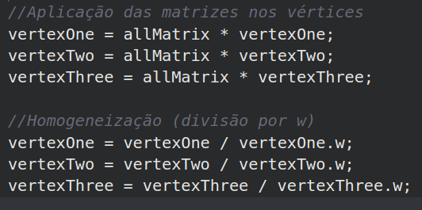
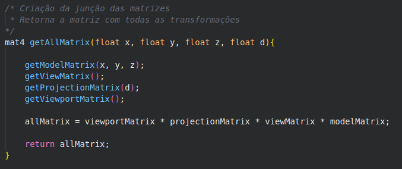
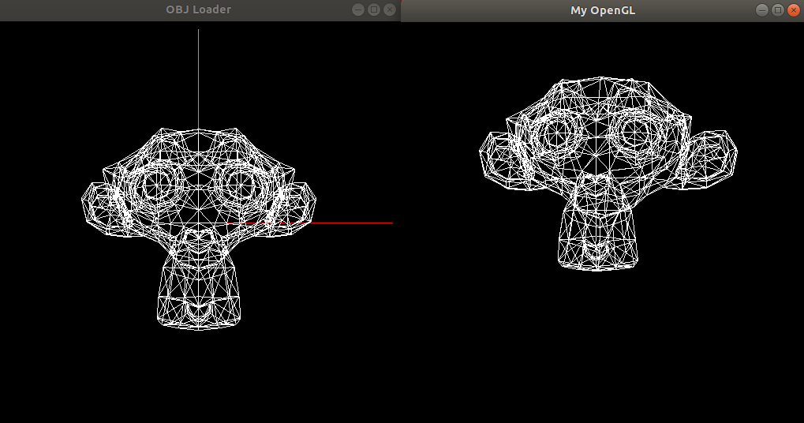
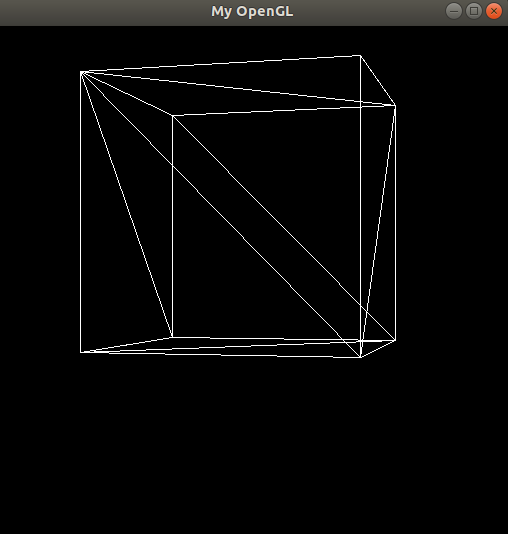
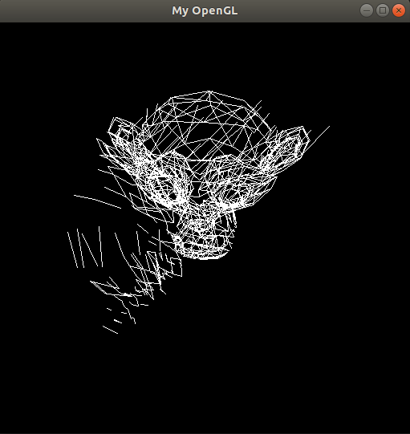

# **Pipeline Gráfico**

## **1. Introdução**

Este trabalho tem como objetivo implementar o pipeline gráfico, passnado os vértices do objeto pelo espaço do objeto até o espaço de tela, através de transformações.

## **2. Transformações**

### **2.1. Espaço do Objeto para o Espaço do Universo**

Na primeira etapa do pipeline gráfico é realizada a transformação dos vértices do objeto que estão no espaço do objeto, local onde os objetos são criados, para o espaço do universo, o sistema de coordenadas da cena. Para isso, é criada a matriz *model* que pode conter a matriz identidade ou pode ser realizada uma composição de translações, escalas, rotações e shears, através da multiplicação dessas matrizes.

> 

Aqui, por exemplo, a matriz *model* é inicializada com a matriz identidade. Após são criadas duas matrizes, a de translação e a de rotação, e então essas matriz são aplicadas a matriz *model* por sua multiplicação. É importante notar que a ordem da multiplicação importa, no caso, a rotação está sendo aplicada primeiro e depois a translação.

Está sendo usada matrizes 4x4 para representar o espaço 3D, utilizando as coordenadas homogêneas.

### **2.2. Espaço do Universo para o Espaço da Câmera**

Após a transformação para o espaço do universo, é necessário realizar outra transição, agora para o espaço da câmera. Vamos precisar definir alguns vetores, um deles vai indicar a posição da câmera da nossa cena, o *lookAt* irá indicar para onde a câmera está "olhando" e o *up* que fixa a câmera. Após deifinir esses vetores podemos determinar a direção da câmera realizando a subtração do vetor *lookAt* com o vetor da posição.

Após essa etapa, devemos definir mais três vetores, para o novo sistema de coordenadas:

* O eixo **Z**: é o resultado negativo da norma do *lookat* menos a posição.

* O eixo **X**: primeiro é realizado o produto vetorial entre o vetor *up* e o vetor do eixo **Z**, depois é calculada a norma desse resultado.

* O eixo **Y**: primeiro é realizado o produto vetorial entre o vetor do eixo **X** e o vetor do eixo **Z**.

> 

Para a transição para o espaço da câmera ocorrer precisamos criar a matriz *view*. Iremos utilizar os vetores já criados para formar duas matrizes, a composição dessas matrizes irá formar a matriz *view*.

A matriz BT é formada pelos vetores dos novos eixos da câmera com a coordenada homogênea, e a matriz de translação é aplicada com sua quarta coluna com o vetor posição negativo e a coordenada homgênea. Após isso, é só multiplicar as matrizes e a matriz *view* é formada.

### **2.3. Espaço da Câmera para o espaço Recorte**

Existem dois tipos de projeções: a projeção ortográfica e a projeção de perspectiva.

    

    <a href="http://forums.codeguru.com/showthread.php?545757-orthographic-projection" > Ortographic projection </a> 

 

Na projeção ortográfica os objetos não são afetados pela distância da câmera, já na projeção de perspectiva, os objetos que estão perto da câmera parecem maiores e os objetos longe da câmera parecem menores.

Foi usado um *float* *d* que indicará a distância do plano mais próximo (*near plane*). Com o valor de *d* podemos montar a matriz de projeção.

### **2.4. Espaço Recorte para o Espaço de Tela**

Agora vamos criar a matriz *viewport*, essa matriz vai levar o objeto do espaço de recorte para o espaço de tela. Para gerar essa matriz vamos fazer a composição de três matrizes, uma de translação e duas de escala.

* A primeira matriz criada é uma de escala, essa matriz server para inverter a direção do eixo **Y**, pois quando o objeto passa por todas as tranformações apresentadas anteriormente ele chega de "cabeça para baixo" na tela.

* Depois é criada uma matriz de translação, nesse caso é aplicada uma translação no eixo x e y. 

* A segunda matriz de escala é criada, essa matriz recebe a largura e altura da tela e divide por dois.

A *viewport* é então criada, lembrando que a ordem da multiplicação **IMPORTA**.

### **2.5. Homogeneização**

Para realizar a homogeneização, temos que simplesmente dividir os vértices do objeto pela coordenada homogênea **w**. Essa etapa pode ser realizada antes da criação da matriz *viewport*, porém por questão de **eficiência** foi escolhido realizar a multiplicação de todas as matriz e sua aplicação nos vértices antes de dividir por **w**.

    
    

## **3. Resultados**

Comparação com o objeto disponibilizado pelo professor.

A primeira figura foi feita pelo professor usando a API OpenGL, a segunda foi realizada por este trabalho. 

### **3.1. Outros Objetos**

## **4. Dificuldades**

A maior dificuldade foi rasterizar as linhas, que foi o primeiro trabalho. O algoritmo deve que ser mudado, pois não estava rasterizando da forma correta.

## **5. Bibliotecas Usadas**

> 1. [glut](https://www.opengl.org/resources/libraries/glut/)
> 2. [glm](https://glm.g-truc.net/0.9.9/index.html)

## **6. Referências**

> 1. Notas de aula do Professor Christian Azambuja Pagot
>2. [On-Line Computer Graphics Notes](http://graphics.idav.ucdavis.edu/education/GraphicsNotes/World-and-Image-Space/World-and-Image-Space.html) 
>3. [Object Space and World Space](http://www.fastgraph.com/help/object_space_and_world_space.html)